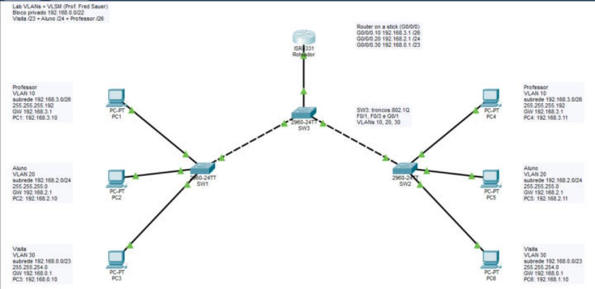
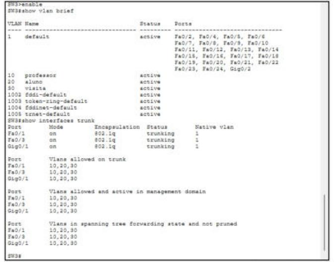
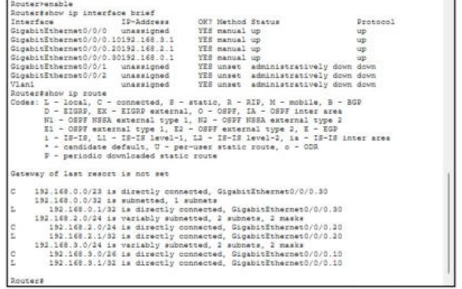
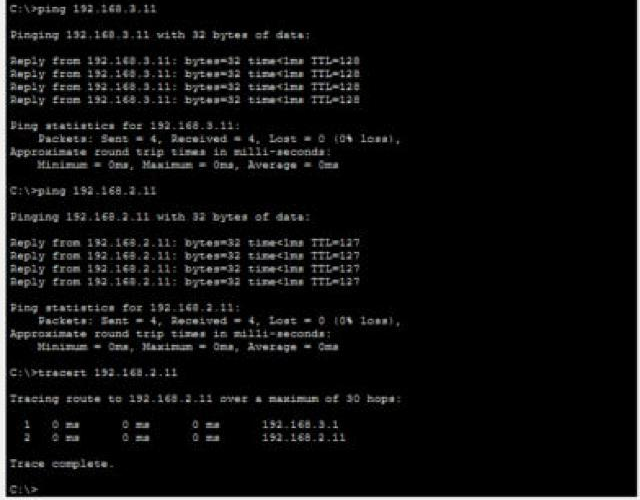
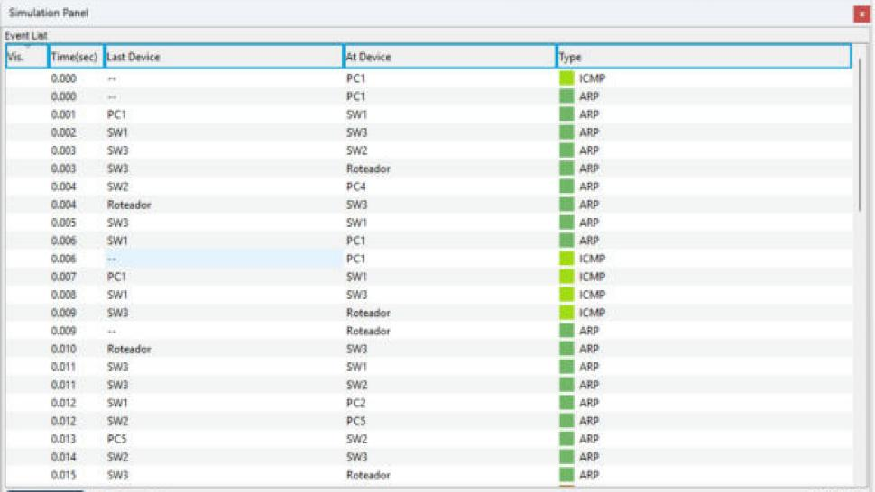

# Lab de VLANs e VLSM no Cisco Packet Tracer

Trabalho da disciplina Redes I (UERJ, Prof. Fred Sauer). O cenário é uma rede de ambiente educacional com três VLANs, endereçamento privado dividido com VLSM e roteamento entre VLANs por *router on a stick*.



## Conteúdo

- [Cenário](#cenário)
- [Endereçamento](#endereçamento)
- [Topologia e portas](#topologia-e-portas)
- [Como abrir e testar](#como-abrir-e-testar)
- [Configuração](#configuração)
- [Resultados dos testes](#resultados-dos-testes)
- [Estrutura do repositório](#estrutura-do-repositório)
- [Relatório](#relatório)
- [Autor](#autor)

## Cenário

O roteiro pede pontos de rede para três grupos:

| Grupo     | VLAN | Pontos |
|-----------|------|-------:|
| Professor | 10   |     60 |
| Alunos    | 20   |    200 |
| Visita    | 30   |    500 |

A tarefa é escolher a melhor distribuição de endereços privados, registrar subrede e gateway de cada VLAN no próprio cenário, configurar VLANs, portas de acesso e troncos nos três switches e fazer o roteamento entre VLANs em uma única interface do roteador.

## Endereçamento

O bloco escolhido foi **192.168.0.0/22**, dividido da maior subrede para a menor. Cada subrede precisa de um endereço a mais que o número de pontos, porque o gateway também ocupa um.

| VLAN | Grupo     | Subrede        | Máscara         | Gateway     | Faixa utilizável            | Broadcast     | Hosts |
|------|-----------|----------------|-----------------|-------------|-----------------------------|---------------|------:|
| 30   | Visita    | 192.168.0.0/23 | 255.255.254.0   | 192.168.0.1 | 192.168.0.1 a 192.168.1.254 | 192.168.1.255 |   510 |
| 20   | Alunos    | 192.168.2.0/24 | 255.255.255.0   | 192.168.2.1 | 192.168.2.1 a 192.168.2.254 | 192.168.2.255 |   254 |
| 10   | Professor | 192.168.3.0/26 | 255.255.255.192 | 192.168.3.1 | 192.168.3.1 a 192.168.3.62  | 192.168.3.63  |    62 |

Sobram dois blocos livres para crescimento: 192.168.3.64/26 e 192.168.3.128/25.

## Topologia e portas

Equipamentos: um roteador ISR 4331, três switches Catalyst 2960-24TT e seis PCs.

| Equipamento | Porta                 | Modo   | VLAN       | Ligada a          |
|-------------|-----------------------|--------|------------|-------------------|
| SW1         | Fa0/11                | acesso | 10         | PC1               |
| SW1         | Fa0/18                | acesso | 20         | PC2               |
| SW1         | Fa0/6                 | acesso | 30         | PC3               |
| SW1         | Fa0/1                 | tronco | 10, 20, 30 | SW3 Fa0/1         |
| SW2         | Fa0/11                | acesso | 10         | PC4               |
| SW2         | Fa0/18                | acesso | 20         | PC5               |
| SW2         | Fa0/6                 | acesso | 30         | PC6               |
| SW2         | Fa0/3                 | tronco | 10, 20, 30 | SW3 Fa0/3         |
| SW3         | Fa0/1, Fa0/3 e Gig0/1 | tronco | 10, 20, 30 | SW1, SW2, roteador |
| Roteador    | G0/0/0 (.10, .20, .30) | 802.1Q | 10, 20, 30 | SW3 Gig0/1        |

| PC  | VLAN | IP           | Máscara         | Gateway     |
|-----|------|--------------|-----------------|-------------|
| PC1 | 10   | 192.168.3.10 | 255.255.255.192 | 192.168.3.1 |
| PC2 | 20   | 192.168.2.10 | 255.255.255.0   | 192.168.2.1 |
| PC3 | 30   | 192.168.0.10 | 255.255.254.0   | 192.168.0.1 |
| PC4 | 10   | 192.168.3.11 | 255.255.255.192 | 192.168.3.1 |
| PC5 | 20   | 192.168.2.11 | 255.255.255.0   | 192.168.2.1 |
| PC6 | 30   | 192.168.1.10 | 255.255.254.0   | 192.168.0.1 |

O PC6 usa 192.168.1.10 de propósito: o 3º octeto é diferente do PC3, mas os dois estão na mesma /23.

## Como abrir e testar

Requisito: Cisco Packet Tracer 8.2.2 ou mais recente. O arquivo foi salvo no formato da 8.2.2 e testado na 9.0.1.

1. Abra `packet-tracer/Lab_VLANs_VLSM_Gabriel_Andre_de_Lima_Silva.pkt`.
2. Espere os enlaces ficarem verdes ou clique em *Fast Forward Time* algumas vezes.
3. No PC1, em *Desktop > Command Prompt*:

   ```
   ping 192.168.3.11
   ping 192.168.2.11
   tracert 192.168.2.11
   ```

4. Nos switches, no CLI:

   ```
   show vlan brief
   show interfaces trunk
   ```

5. No roteador:

   ```
   show ip interface brief
   show ip route
   ```

Se o arquivo não abrir na sua versão, `configs/comandos_lab_vlans_vlsm.txt` traz todos os comandos para montar o cenário do zero.

## Configuração

Troncos (exemplo do SW3; o SW1 usa a Fa0/1 e o SW2 a Fa0/3):

```
interface f0/1
 switchport mode trunk
 switchport trunk allowed vlan 10,20,30
interface f0/3
 switchport mode trunk
 switchport trunk allowed vlan 10,20,30
interface g0/1
 switchport mode trunk
 switchport trunk allowed vlan 10,20,30
```

Subinterfaces do roteador:

```
interface g0/0/0.10
 encapsulation dot1Q 10
 ip address 192.168.3.1 255.255.255.192
interface g0/0/0.20
 encapsulation dot1Q 20
 ip address 192.168.2.1 255.255.255.0
interface g0/0/0.30
 encapsulation dot1Q 30
 ip address 192.168.0.1 255.255.254.0
interface g0/0/0
 no shutdown
```

A configuração completa de cada equipamento, como está gravada na startup-config do `.pkt`, fica em `configs/`.

## Resultados dos testes

Testes feitos no Packet Tracer 9.0.1 depois de reiniciar o cenário (*power cycle*).

| Teste | Resultado |
|-------|-----------|
| PC1 → PC4 (mesma VLAN) | resposta com TTL=128, sem passar pelo roteador |
| PC1 → PC5 e PC1 → PC6 (outras VLANs) | resposta com TTL=127, um salto de roteador |
| PC6 → gateway 192.168.0.1 | resposta com TTL=255 |
| `tracert` PC1 → PC5 | 192.168.3.1 e depois 192.168.2.11 |
| `tracert` PC6 → PC2 | 192.168.0.1 e depois 192.168.2.10 |
| `tracert` PC3 → PC6 | um salto só (mesma /23) |
| Broadcast ARP do PC1 no modo simulação | chega só ao PC4 e ao roteador (VLAN 10) |

Troncos e VLANs no SW3:



Subinterfaces e rotas do roteador:



Ping e tracert do PC1:



Lista de eventos do modo simulação no ping do PC1 para o PC5. O ARP do PC1 fica na VLAN 10 e o ARP do roteador fica na VLAN 20:



As outras telas (SW1, SW2, PC3, PC6 e a continuação da simulação) estão em `relatorio/latex/prints/`.

## Estrutura do repositório

```
.
├── packet-tracer/
│   └── Lab_VLANs_VLSM_Gabriel_Andre_de_Lima_Silva.pkt   cenário pronto
├── configs/
│   ├── sw1.cfg, sw2.cfg, sw3.cfg, roteador.cfg          startup-config de cada equipamento
│   └── comandos_lab_vlans_vlsm.txt                      comandos para montar do zero
└── relatorio/
    ├── Lab_VLANs_VLSM_Gabriel_Andre_de_Lima_Silva.pdf   relatório
    └── latex/                                           fontes (XeLaTeX) e telas dos testes
```

## Relatório

O [relatório em PDF](relatorio/Lab_VLANs_VLSM_Gabriel_Andre_de_Lima_Silva.pdf) traz as contas do VLSM em binário, a explicação de cada comando, a análise do ping no modo simulação e as telas dos testes.

Para compilar os fontes:

```
cd relatorio/latex
xelatex relatorio.tex
xelatex relatorio.tex
xelatex relatorio.tex
```

## Autor

Gabriel André de Lima Silva. Trabalho da disciplina Redes I, UERJ, 2026.
